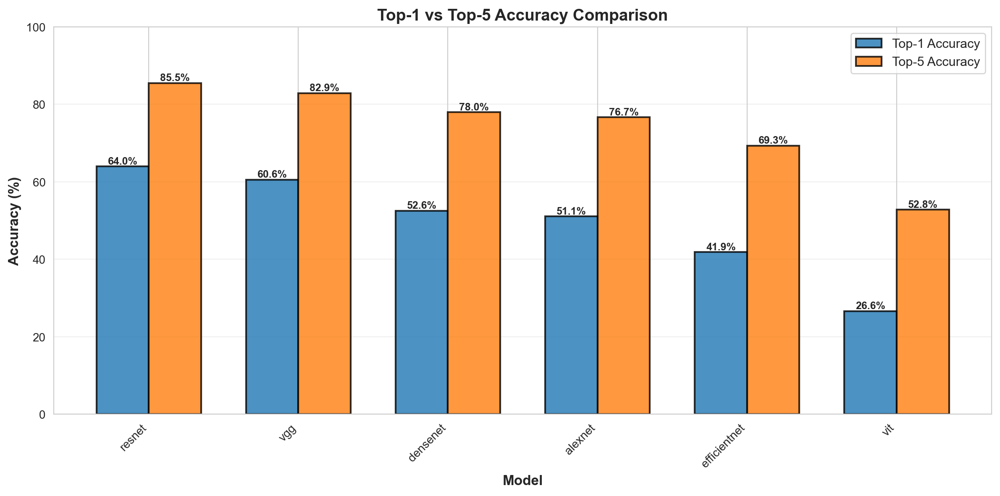

# Image Classification on Tiny ImageNet-200

A comprehensive exploration of deep learning architectures for image classification, tracing the evolution of convolutional neural networks and vision transformers from 2012 to 2020. This project implements six landmark architectures from scratch and compares their performance, efficiency, and training dynamics on the Tiny ImageNet-200 dataset.

All models were trained from scratch using consumer hardware, demonstrating that meaningful deep learning research is possible without expensive GPUs or cloud resources.

## Quick Start

**Train the best model (ResNet-18):**
```bash
# 1. Download dataset
wget http://cs231n.stanford.edu/tiny-imagenet-200.zip
unzip tiny-imagenet-200.zip -d data/raw/

# 2. Preprocess
python src/data/curate_data.py

# 3. Train
python src/train.py --model resnet --epochs 80 --mixup_cutmix_alpha 0.4
```

**Use trained model for inference:**
```bash
python src/infer.py --model resnet --image path/to/image.jpg --top_k 5
```

## Motivation

Image classification has been the cornerstone problem driving deep learning innovation over the past decade. This project explores how architectural innovations have progressively improved our ability to learn visual representations:

- **AlexNet (2012):** Sparked the deep learning revolution by demonstrating that large CNNs trained on GPUs could dramatically outperform traditional computer vision methods
- **VGG-16 (2014):** Showed that network depth and architectural simplicity could yield strong performance through stacked 3×3 convolutions
- **ResNet-18 (2015):** Solved the degradation problem in very deep networks using residual connections, enabling networks with hundreds of layers
- **DenseNet-121 (2017):** Introduced dense connectivity patterns for extreme parameter efficiency through feature reuse
- **EfficientNet-B0 (2019):** Demonstrated compound scaling—systematically balancing depth, width, and resolution
- **Vision Transformer (2020):** Brought attention mechanisms from NLP to vision, challenging the dominance of convolutional architectures

Each architecture represents a fundamental shift in how we approach visual learning. By implementing and training these models, this project provides empirical insights into their relative strengths, limitations, and computational trade-offs on a modern dataset.

### Key Project Features

- **Complete implementations**: All six architectures in PyTorch, adapted for Tiny ImageNet's 64×64 resolution
- **Detailed comparison**: Accuracy, parameter efficiency, memory usage, and training dynamics
- **Modern training techniques**: MixUp/CutMix augmentation, cosine annealing, label smoothing, and learning rate warmup
- **Reproducible pipeline**: training-to-analysis workflow with JSON logging and visualization notebooks

## Results

All six architectures were successfully trained from scratch on consumer hardware, with architectural modifications enabling training on limited resources while maintaining competitive performance. Despite minimal hyperparameter tuning and a single training run per model, four of six models exceeded 50% accuracy on this challenging 200-class task.
<!-- 
| Model | Test Acc | Top-5 Acc | Params | Memory | Training Time |
|-------|----------|-----------|--------|--------|---------------|
| **ResNet-18** | **64.01%** | **85.52%** | 11.3M | 3.9 GB | 30 hours |
| **VGG-16** | **60.58%** | 82.90% | 14.8M | 2.9 GB | 24 hours |
| **DenseNet-121** | **52.56%** | 78.00% | 2.2M | 13.1 GB | 24 hours |
| AlexNet | 51.09% | 76.65% | 15.7M | 2.7 GB | 16 hours |
| EfficientNet-B0 | 41.87% | 69.35% | 4.5M | 2.1 GB | 5 hours |
| ViT-S/16 | 26.64% | 52.83% | 21.6M | 8.4 GB | 22 hours | -->



### Analysis

ResNet-18 achieved the best performance with 64.01% test accuracy, followed by VGG-16 at 60.58%—strong results considering the complexity of distinguishing 200 classes on consumer hardware. Four of six models exceeded 50% accuracy, demonstrating that with thoughtful architectural modifications, landmark deep learning architectures can be successfully trained without expensive computational resources. ResNet-18's superior performance despite having fewer parameters than both VGG (14.8M) and AlexNet (15.7M) demonstrates that architectural design—specifically residual connections—matters more than raw model size.

Both ResNet and VGG exhibited remarkably stable convergence with smooth learning curves throughout training. ResNet shows an unusual pattern where training accuracy (60.5%) is lower than validation accuracy (64.8%)—this reflects the effect of aggressive MixUp/CutMix augmentation making the training task artificially harder while evaluation happens on clean images. This augmentation strategy proves critical, contributing 3-5% improvement in final accuracy. DenseNet presents an intriguing trade-off: it's the most parameter-efficient model, achieving 52.56% accuracy with only 2.2M parameters, but its dense connectivity pattern results in the highest memory consumption at 13.1 GB.

Vision Transformer performed poorly at 26.64% accuracy despite having the most parameters (21.6M) and substantial training time, exhibiting unstable training with significant oscillations. This empirically confirms that transformers need massive datasets to overcome their lack of spatial inductive biases—without convolutional structure, self-attention struggles to discover spatial relationships from just 80,000 training images. Similarly, EfficientNet's underwhelming performance (41.87%) reveals its dependence on higher-resolution inputs, as the compound scaling strategy breaks down on Tiny ImageNet's 64×64 images.

Error analysis showed mistakes clustered among visually similar classes like different dog breeds or vehicle types. The large gap between Top-1 and Top-5 accuracy (12-25 percentage points) indicates that even when models get the exact class wrong, they often identify semantically related alternatives, suggesting the 64×64 resolution constrains fine-grained discrimination while capturing broader semantic features.

### Key Takeaways

This project demonstrates that meaningful deep learning research is accessible without expensive hardware or extensive computational resources. Through careful architectural modifications and modern training techniques, six landmark architectures spanning 2012-2020 were successfully trained in just 5-30 hours each, with four achieving over 50% accuracy on a challenging 200-class dataset. The results validate that thoughtful engineering and understanding of model architectures can overcome significant resource constraints.

### Further Details

For detailed analysis and visualizations, see the Jupyter notebooks:
- `notebooks/training_dynamics.ipynb` - Learning curves, LR schedules, and convergence analysis
- `notebooks/error_analysis.ipynb` - Confusion matrices, per-class performance, and failure modes
- `notebooks/results_analysis.ipynb` - Comprehensive accuracy, efficiency analysis and trade-off comparisons

## Models

The project implements six architectures:

| Model | Year | Key Innovation | Parameters | Custom Modifications |
|-------|------|----------------|------------|---------------------|
| AlexNet | 2012 | Deep CNN with ReLU + Dropout | 15.7M | Reduced kernel sizes, added BatchNorm |
| VGG-16 | 2014 | Stacked 3×3 convolutions | 14.8M | Added BatchNorm, replaced FC with GAP |
| ResNet-18 | 2015 | Residual skip connections | 11.3M | Removed initial MaxPool, added dropout |
| DenseNet-121 | 2017 | Dense feature reuse | 2.2M | Conv stem instead of 7×7+pool |
| EfficientNet-B0 | 2019 | Compound scaling + MBConv | 4.5M | Standard dropout in classifier |
| ViT-S/16 | 2020 | Pure attention mechanism | 21.6M | Convolutional patch embedding |

All architectures were originally designed for ImageNet's 224×224 images and have been modified to adapt to Tiny ImageNet's 64×64 resolution, improve training stability, and reduce computational cost. Each model file under `src/models/` contains comprehensive documentation, PyTorch implementation, and detailed modification notes.

### Hardware Used
- **Device**: MacBook with Apple Silicon (M-series)
- **Memory**: 8GB+ RAM (16GB recommended for DenseNet) with unified memory architecture (GPU shares system RAM)
- **Backend**: MPS (Metal Performance Shaders)

## Dataset: Tiny ImageNet-200

Tiny ImageNet is a subset of the ImageNet dataset, created by Stanford University for the CS231n course. It maintains the multi-class classification challenge of ImageNet while reducing computational requirements.

**Dataset Statistics:**
- **Classes**: 200 (subset of ImageNet-1000)
- **Training images**: 100,000 (500 per class)
- **Validation images**: 10,000 (50 per class)
- **Image resolution**: 64×64 RGB
- **Download**: [Stanford CS231n](http://cs231n.stanford.edu/tiny-imagenet-200.zip)

**Data Split Strategy:**

The original validation set is used as the test set. The training set is split into:
- **Training**: 80,000 images (400 per class, 80%)
- **Validation**: 20,000 images (100 per class, 20%)

This ensures class-balanced splits for reliable evaluation.

**Preprocessing Pipeline:**

1. Download and extract the dataset to `data/raw/tiny-imagenet-200/`
2. Run `python src/data/curate_data.py` to reorganize the directory structure:
   - Moves training images from `train/n*/images/` to `train/n*/`
   - Parses `val_annotations.txt` to organize validation images by class
   - Creates human-readable class name mappings in `data/class_mappings/`
3. Data loaders apply augmentation transforms during training:
   - Random crop with padding (64×64, padding=4)
   - Random horizontal flip (p=0.5)
   - Random rotation (±10 degrees)
   - Color jitter (brightness, contrast, saturation, hue)
   - Random erasing (p=0.5)
   - Normalization using ImageNet statistics (mean=[0.485, 0.456, 0.406], std=[0.229, 0.224, 0.225])

For detailed exploration, see `notebooks/data_exploration.ipynb`.

## Training Configuration

The training script (`src/train.py`) supports the following configuration:

### Basic Arguments
```bash
--model {alexnet,resnet,densenet,vgg,vit,efficientnet}
                        Model architecture to train (required)
--epochs EPOCHS         Number of training epochs (default: 50)
--batch_size BATCH_SIZE
                        Batch size for training (default: 128)
--lr LR                 Initial learning rate (default: 0.1)
--weight_decay WEIGHT_DECAY
                        L2 regularization coefficient (default: 1e-3)
```

### Optimizer Configuration
```bash
--optimizer {sgd,adam,adamw,rmsprop}
                        Optimization algorithm (default: sgd)
--scheduler {cosine,none}
                        Learning rate scheduler (default: cosine)
```

### Advanced Training Techniques
```bash
--mixup_cutmix_alpha ALPHA
                        MixUp/CutMix alpha parameter (0=disabled, 0.2-1.0=enabled)
                        Recommended: 0.4 for ResNet/VGG
--warmup_epochs EPOCHS  Number of learning rate warmup epochs (default: 0)
                        Recommended: 10 for Vision Transformer
--warmup_start_lr LR    Starting LR for warmup phase (default: 1e-6)
```

### Checkpoint Management
```bash
--resume PATH           Resume training from checkpoint
--total_epochs EPOCHS   Total epochs for LR scheduler when training in batches
```

## Project Structure

```
image-classification/
├── src/
│   ├── train.py                    # Main training script
│   ├── test.py                     # Model evaluation (Top-1/Top-5 accuracy)
│   ├── infer.py                    # Single image inference
│   ├── data/
│   │   ├── curate_data.py          # Dataset reorganization script
│   │   ├── load_data.py            # DataLoader with train/val splitting
│   │   ├── transforms.py           # Augmentation pipeline
│   │   └── explore_data.py         # Dataset statistics utility
│   └── models/
│       ├── alexnet.py              # AlexNet (2012): Deep CNN revolution
│       ├── vgg16.py                # VGG-16 (2014): Depth through 3×3 stacks
│       ├── resnet18.py             # ResNet-18 (2015): Residual connections
│       ├── densenet121.py          # DenseNet-121 (2017): Dense connectivity
│       ├── efficientnet_b0.py      # EfficientNet-B0 (2019): Compound scaling
│       ├── vit_s_16.py             # ViT-S/16 (2020): Vision Transformers
│       └── utils/
│           └── utils.py            # Parameter counting utilities
├── notebooks/
│   ├── data_exploration.ipynb      # Dataset statistics and visualization
│   ├── training_dynamics.ipynb     # Learning curves and LR schedules
│   ├── error_analysis.ipynb        # Confusion matrices and failure modes
│   └── results_analysis.ipynb      # Comprehensive model comparison
├── plots/
│   ├── plot_training_loss.py       # Generate loss curves per model
│   ├── plot_training_acc.py        # Generate accuracy curves per model
│   └── {model}/                    # Generated plots for each model
├── results/
│   ├── model_comparison.csv        # Summary table of all model results
│   └── {model}/
│       ├── history.json            # Training/validation metrics per epoch
│       ├── test_results.json       # Final test evaluation
│       ├── best_model.pth          # Checkpoint with best validation accuracy
│       └── checkpoint_epoch_*.pth  # Periodic training checkpoints
├── data/
│   ├── raw/tiny-imagenet-200/      # Original dataset
│   ├── curated/                    # Preprocessed dataset
│   └── class_mappings/             # Class ID to name mappings
├── config.py                       # Hyperparameter configuration
├── requirements.txt                # Python dependencies
└── README.md                       # This file
```

### Typical Workflow

The complete pipeline from data preparation to analysis:

1. **Data Preparation** - Download and preprocess dataset (see [Quick Start](#quick-start))

2. **Model Training** (see [Quick Start](#quick-start) for example)

   **Outputs**:
   - `results/resnet/best_model.pth`: Model checkpoint with best validation accuracy
   - `results/resnet/history.json`: Training/validation loss and accuracy per epoch
   - `results/resnet/test_results.json`: Final test set evaluation (Top-1 and Top-5 accuracy)

3. **Visualization**
   ```bash
   # Generate training curves
   python plots/plot_training_loss.py --model resnet
   python plots/plot_training_acc.py --model resnet
   ```

   **Outputs**:
   - `plots/resnet/training_loss.png`
   - `plots/resnet/training_accuracy.png`

4. **Analysis**

   Open Jupyter notebooks in `notebooks/` to:
   - Compare training dynamics across models
   - Analyze error patterns and confusion matrices
   - Evaluate parameter efficiency and memory usage
   - Generate comprehensive result tables and visualizations

This pipeline was followed for all six models, enabling systematic comparison with consistent experimental settings.

## Limitations

- **Hardware constraints**: Batch sizes and model capacities were limited by available memory. Larger batch sizes might improve training stability and final performance.
- **Single training run**: Results reflect a single run with minimal hyperparameter tuning. Grid search or multiple runs would provide more robust performance estimates.
- **No ensemble methods**: Ensembles would likely improve accuracy at the cost of computational resources.
- **Fixed resolution**: Findings may not generalize to higher resolutions where spatial detail matters more.
- **No transfer learning**: Pre-training on larger datasets would significantly improve performance, particularly for data-hungry architectures like ViT.

These constraints reflect realistic research conditions for individual researchers and small teams, making the findings broadly applicable to resource-constrained settings.

## Future Directions

**Architecture Extensions**
- Implement ConvNeXt and Swin Transformer (post-2020 architectures)
- Apply knowledge distillation to compress ResNet-18 for deployment
- Evaluate robustness under distribution shift and adversarial perturbations

**Training & Efficiency**
- Integrate automated augmentation (RandAugment, TrivialAugment)
- Apply pruning, quantization, and mixed-precision training
- Experiment with few-shot learning and transfer learning from full ImageNet

## Contributing

Contributions are welcome! Particularly interested in additional architectures, training optimizations, and bug fixes.

## License

This project is licensed under the MIT License - see [LICENSE](LICENSE) file for details.

## References

### Architectures

1. **AlexNet**: Krizhevsky, A., Sutskever, I., & Hinton, G. E. (2012). ImageNet classification with deep convolutional neural networks. *NeurIPS*.

2. **VGG**: Simonyan, K., & Zisserman, A. (2014). Very deep convolutional networks for large-scale image recognition. *ICLR*.

3. **ResNet**: He, K., Zhang, X., Ren, S., & Sun, J. (2016). Deep residual learning for image recognition. *CVPR*.

4. **DenseNet**: Huang, G., Liu, Z., Van Der Maaten, L., & Weinberger, K. Q. (2017). Densely connected convolutional networks. *CVPR*.

5. **EfficientNet**: Tan, M., & Le, Q. (2019). EfficientNet: Rethinking model scaling for convolutional neural networks. *ICML*.

6. **Vision Transformer**: Dosovitskiy, A., et al. (2020). An image is worth 16x16 words: Transformers for image recognition at scale. *ICLR*.

### Dataset

7. **Tiny ImageNet**: Stanford CS231n course. http://cs231n.stanford.edu/tiny-imagenet-200.zip

### Training Techniques

8. **MixUp**: Zhang, H., et al. (2017). mixup: Beyond empirical risk minimization. *ICLR*.

9. **CutMix**: Yun, S., et al. (2019). CutMix: Regularization strategy to train strong classifiers with localizable features. *ICCV*.

10. **Label Smoothing**: Szegedy, C., et al. (2016). Rethinking the inception architecture for computer vision. *CVPR*.
